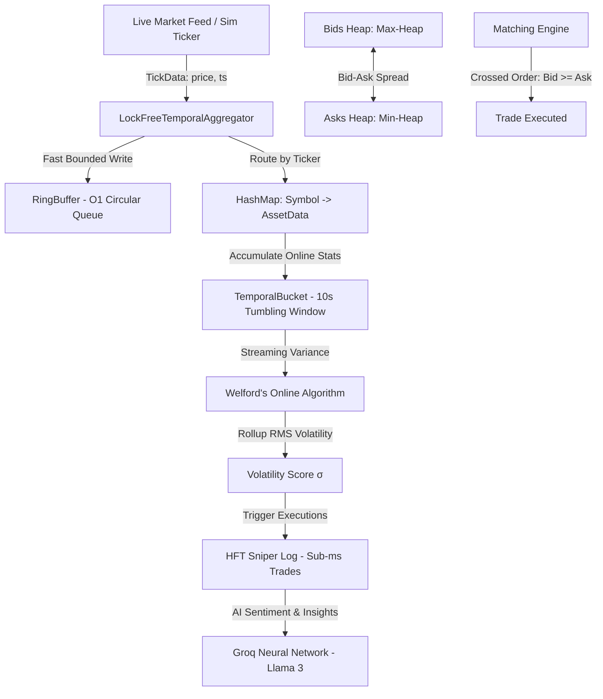

# ⚡ VoltAgg: High-Throughput Non-Blocking Temporal Aggregator & HFT Simulation Engine

[](https://nextjs.org/)
[](https://react.dev/)
[](https://www.typescriptlang.org/)
[](https://isocpp.org/)
[](https://tailwindcss.com/)

VoltAgg is an ultra-high performance, dual-engine (C++ / TypeScript) financial data processing pipeline designed for **sub-millisecond volatility estimation and automated trade execution (sniping)** in High-Frequency Trading (HFT) environments.

Built as an advanced Data Structures Course Project, VoltAgg integrates low-level, lock-free circular memory buffers, online streaming variance trackers, binary heap matching engines, and probabilistic filters into an interactive real-time dashboard.

---

## 🏗️ System Architecture & Data Pipelines

The VoltAgg engine ingests thousands of market ticks per second via real-time WebSockets (Binance API) or our native high-frequency simulation engine. It pipes these ticks through lock-free, zero-allocation data structures to compute volatility rollups and match orders instantly.



---

## 🧬 Core Data Structures & Performance Modeling

### 1. Lock-Free RingBuffer (`RingBuffer<T>`)
* **Location:** [dataStructures.ts](file:///f:/Prathamesh/College/sem%204/DS%20CP%20Grok/src/lib/dataStructures.ts#L1-L18) | [dataStructures.cpp](file:///f:/Prathamesh/College/sem%204/DS%20CP%20Grok/src/lib/dataStructures.cpp#L13-L50)
* **Complexity:** Write: $O(1)$ | Read: $O(1)$ | Space: $O(K)$ bounded.
* **Theory:** Standard JavaScript arrays suffer from $O(N)$ shift operations and garbage collection pauses when memory is reclaimed. The RingBuffer uses a fixed-capacity circular memory block where a single `head` wraps using modulo arithmetic: `(head + 1) % size`. 
* **HFT Benefit:** Eliminates GC pressure entirely and guarantees high CPU L1/L2 cache locality due to contiguous array layout.

### 2. TemporalBucket & Welford's Algorithm
* **Location:** [ds1.ts](file:///f:/Prathamesh/College/sem%204/DS%20CP%20Grok/src/lib/ds1.ts#L209-L292) | [dataStructures.cpp](file:///f:/Prathamesh/College/sem%204/DS%20CP%20Grok/src/lib/dataStructures.cpp#L53-L98)
* **Complexity:** Update: $O(1)$ | Calculate: $O(1)$ | Space: $O(1)$ auxiliary memory.
* **Theory:** Traditional standard deviation requires keeping a history of ticks and doing a two-pass calculation (mean first, then variance). VoltAgg employs **Welford's Online Algorithm** to track streaming stats using three cumulative values: `count`, `mean`, and `M2` (running sum of squares of differences from the mean):
  $$\delta_n = x_n - \mu_{n-1}$$
  $$\mu_n = \mu_{n-1} + \frac{\delta_n}{n}$$
  $$M_{2,n} = M_{2,n-1} + \delta_n (x_n - \mu_n)$$
  $$\sigma^2 = \frac{M_{2,n}}{n - 1}$$
* **HFT Benefit:** Provides numerically stable, real-time variance calculations in a single pass without storing past data.

### 3. Dual-Heap Order Book Matching Engine (`OrderBook`)
* **Location:** [ds1.ts](file:///f:/Prathamesh/College/sem%204/DS%20CP%20Grok/src/lib/ds1.ts#L577-L670) | [heap.cpp](file:///f:/Prathamesh/College/sem%204/DS%20CP%20Grok/src/lib/heap.cpp#L85-L100)
* **Complexity:** Order Insertion: $O(\log N)$ | Peek Spread: $O(1)$ | Match popped: $O(\log N)$.
* **Theory:** Manages Buy Orders (Bids) inside a **Max-Heap** (highest bid at the root) and Sell Orders (Asks) inside a **Min-Heap** (lowest ask at the root). When the best bid is greater than or equal to the best ask, the matching engine executes a trade, popping both roots.

### 4. LRU Cache (`LRUCache<K, V>`)
* **Location:** [ds1.ts](file:///f:/Prathamesh/College/sem%204/DS%20CP%20Grok/src/lib/ds1.ts#L780-L800)
* **Complexity:** Get: $O(1)$ | Put: $O(1)$.
* **Theory:** A hybrid structure combining a **HashMap** (for rapid lookup) with a **Doubly Linked List** (for tracking access history). Used to store calculated volatility measurements to prevent redundant traversals across inactive historical time buckets.

---

## 🖥️ Interactive Dashboard Features

The dashboard provides a futuristic, high-fidelity terminal interface designed with HSL-gradient palettes, neon accents, and smooth physics-based graphics.

| Module | Description | Visual Tech |
|---|---|---|
| **Real-time Price Ticker** | Ingests live Binance ticks and updates tickers at sub-second frequencies. | Canvas API + Chart.js |
| **Node Mesh Volatility Heatmap** | Dynamic 2D canvas overlay running a distance-based node mesh that animates and changes colors based on the current volatility standard deviation ($\sigma$). | HTML5 Canvas + Physics simulation |
| **HFT Sniper Log** | Displays automated mock order executions triggered by localized volatility spikes, displaying actual latencies down to $0.1\text{ms}$. | React Hook State + Tailwind CSS |
| **L2 Depth Book** | Real-time order book depicting buy/sell spreads and volumes. | CSS Grids + Zustand Reactive Store |
| **Strategy Backtester** | Allows strategy simulation over extreme historical periods (Flash Crash 2010, FTX collapse, COVID market drop). | Asynchronous JS Intervals |
| **Groq Neural Network** | Ingests real-time volatility data and queries Llama 3 models via Groq API to supply technical HFT routing recommendations. | REST API + Stream-Rendering |

---

## 📂 Project Directory Structure

```
VoltAgg/
├── public/                 # Static assets & icons
├── src/
│   ├── app/                # Next.js App Router Page components
│   │   ├── backtest/       # Backtesting Engine UI
│   │   ├── depth/          # L2 Order Book Depth visualization
│   │   ├── groq/           # Groq AI sentiment configuration & terminal
│   │   ├── heatmap/        # Live Node-Mesh Volatility Heatmap
│   │   ├── sniper/         # Volatility Sniping execution logs & asset grid
│   │   ├── globals.css     # Premium styling configurations
│   │   ├── layout.tsx      # Main application frame
│   │   └── page.tsx        # Hero landing with real-time AAPL feed
│   ├── components/         # Reusable dashboard components
│   │   ├── Chatbot.tsx     # Groq AI inline chat assistant
│   │   └── Navigation.tsx  # Dynamic header with running ticker & latency tracker
│   └── lib/                # Computational engine core
│       ├── dataStructures.cpp # Lock-free Ring Buffer & Tumbling bucket C++ core
│       ├── dataStructures.ts  # Standard TS variants for the frontend
│       ├── ds1.ts             # 1,000+ lines of raw Data Structures (SkipLists, Bloom Filters, Heaps)
│       ├── heap.cpp           # C++ Binary Heap implementation
│       ├── heap.ts            # TypeScript Binary Heap priority queues
│       ├── store.cpp          # C++ Standalone High-Frequency Simulator Main
│       └── store.ts           # Zustand global state coordinator & TS simulator
├── package.json            # Node configuration & dependencies
└── tsconfig.json           # TypeScript configuration
```

---

## ⚡ Setup and Execution

### Prerequisites
- [Node.js](https://nodejs.org/) (v18.x or above)
- A C++ Compiler (GCC, Clang, or MSVC) for the C++ backend models

---

### Running the Web Dashboard

1. **Install Dependencies**
   ```bash
   npm install
   ```

2. **Run Development Server**
   ```bash
   npm run dev
   ```

3. **Build and Start Production Server**
   ```bash
   npm run build
   npm run start
   ```

4. **Access UI**
   Open your browser and navigate to `http://localhost:3000`.

---

### Running the Standalone C++ Simulation Core

To run the ultra-high throughput C++ simulator which prints live execution outputs directly to your terminal:

1. **Compile the Simulation Store**
   ```bash
   # Navigate to the library folder
   cd src/lib

   # Compile with maximum compiler optimizations (-O3)
   g++ -O3 store.cpp -o store_sim
   ```

2. **Run the Simulator**
   ```bash
   # On Windows (PowerShell/CMD):
   ./store_sim.exe

   # On Linux/macOS:
   ./store_sim
   ```

3. **Sample Terminal Output:**
   ```text
   Starting High-Frequency Simulation Engine...
   [SNIPER] LONG AAPL @ $277.1042 (Vol: 0.0010)
   [SNIPER] SHORT NVDA @ $196.8921 (Vol: 0.0024)
   [SNIPER] LONG MSFT @ $416.7815 (Vol: 0.0019)
   ```

---

## 🧠 Groq AI Configuration
To enable the technical insight engine and the inline HFT virtual assistant, navigate to the **Groq AI** tab in the dashboard and input your Groq API key (`gsk_...`). The assistant will parse live volatility data directly and output real-time order routing instructions using Llama-3 models.

---

## 📜 License
This project is licensed for educational use as part of the CS Data Structures Course Curriculum. All custom data structures were implemented from scratch.
